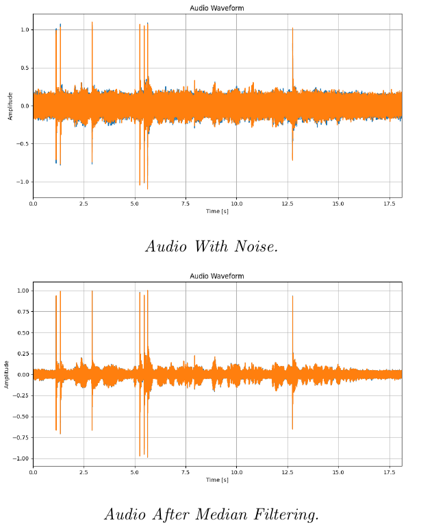
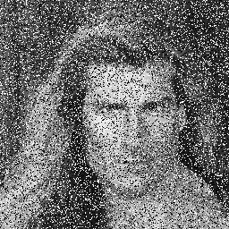
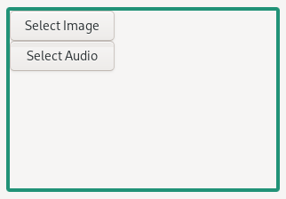
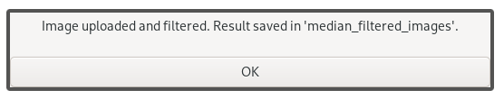

# What is Median Filtering?
Median filtering is a non-linear digital filtering technique commonly used to remove noise from signals, particularly in images and sound. The key idea is to replace each value in the dataset with the median of its neighboring values. This method is effective in preserving edges while reducing noise, especially for salt-and-pepper noise.

This code is designed to demonstrate the concept of median filtering and its application in both image and audio processing, where images are represented as 2-dimensional arrays and audio as 1-dimensional arrays. 

## Effect on 1D Arrays (e.g., Sounds)
- Noise Reduction: In audio signals, median filtering can effectively remove impulsive noise (like clicks or pops) without significantly distorting the original signal.
- Edge Preservation: Unlike linear filters, which may blur the signal, median filtering maintains sharp transitions in sound, preserving important features like transients.
- Latency: Depending on the filter window size, there might be a slight delay in processing, as the filter needs to collect surrounding samples.



## Effect on 2D Arrays (e.g., Images)
-  Noise Reduction: Median filtering is particularly effective against salt-and-pepper noise, where random pixels are either set to maximum or minimum values.
-  Edge Preservation: It preserves edges better than linear smoothing filters, making it ideal for image processing where details are important.
-  Blockiness: For larger kernel sizes, median filtering can introduce block-like artifacts if not applied carefully.

<div style="display: flex; justify-content: space-around;">
<figure>
  
  <figcaption>Original Image With Noise.</figcaption>
</figure>

<figure>
  
  <figcaption>Image After Appling Median Filtering Using 3x3 Window Size.</figcaption>
</figure>
</div>
<div style="display: flex; justify-content: space-around;">
<figure>
  
  <figcaption>Image After Appling Median Filtering Using 5x5 Window Size.</figcaption>
</figure>

<figure>
  
  <figcaption>Image After Appling Median Filtering Using 7x7 Window Size.</figcaption>
</figure>
</div>

---

# How to compile and run the code?
To compile and run the code, you'll need the following dependencies:
- g++ : This is the compiler used to build the project.
- pkg-config : s used to retrieve the necessary flags for compiling and linking libraries, particularly gtk+-3.0 and opencv4.
- GTK+ 3.0 : The GTK+ 3.0 library is required for building the graphical user interface (GUI) components.
- OpenCV 4 : OpenCV 4 is used for image and video processing tasks, such as applying filters and manipulating images.
- libsndfile : This library is used for reading and writing audio files (required for the voice processing components).
Make (optional but recommended): A Makefile is provided in the project to automate the build process, so you don’t need to manually type out the compilation command.

The packages name might change for different distributions and operating system that you use but as exmaple:

**For Ubuntu/Debian:**
```sh
sudo apt update
sudo apt install g++ pkg-config libgtk-3-dev libopencv-dev libsndfile1-dev make
```
**For Arch:**
```sh
sudo pacman -S g++ pkg-config gtk3 opencv libsndfile make
```

After intalling the reuqirements and cloing the repo all you need is to run make to compile the program:
``` sh
$ make
```

## Running the Code
Once the code is compiled, you can run the executable as follows:
```sh
./noise_removal_median_filtering
```



After Appling median filtering the result image/audio will be saved under directories named `median_filtered_images`/`median_filtered_audios`. If these directories are not exists the program creates them and save the result under them.

